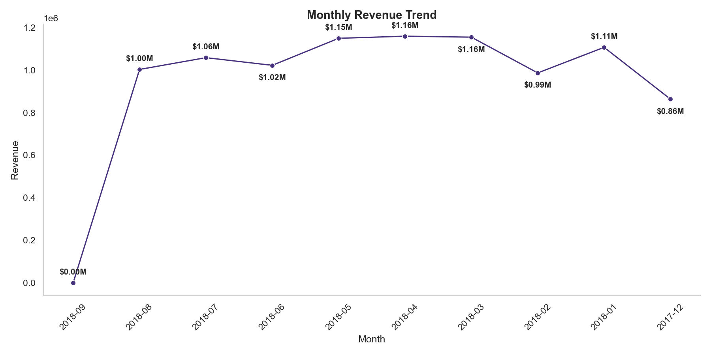
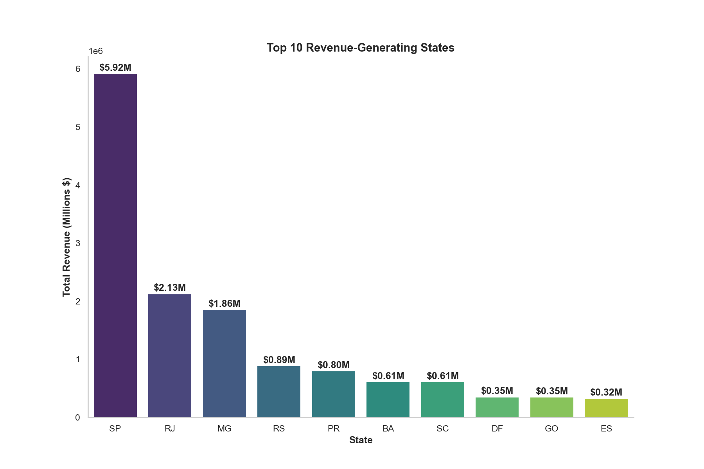
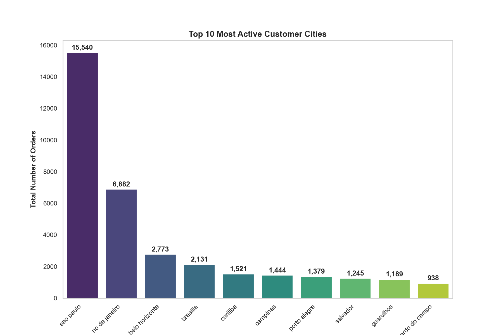
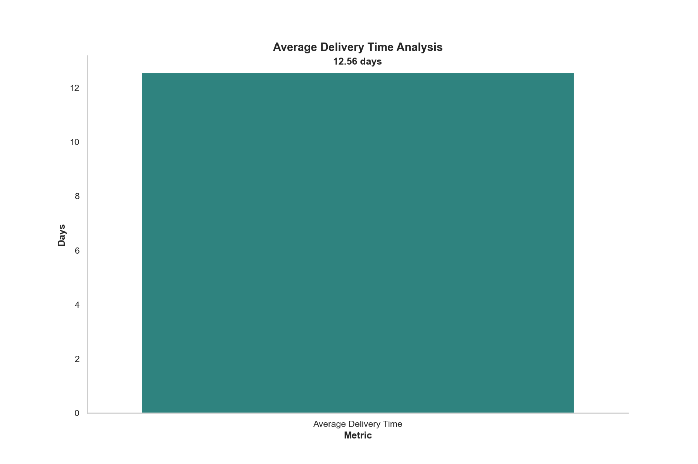
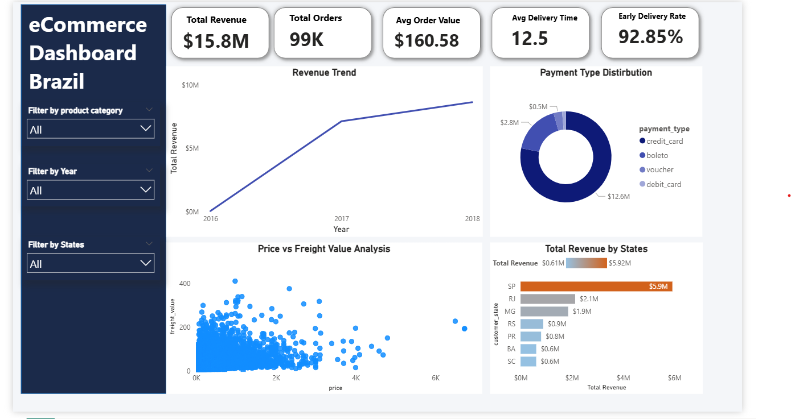

# 📊 E-Commerce Business Intelligence

End-to-end e-commerce business analysis using SQL, Python, exploratory data analysis (EDA), and customer segmentation to identify revenue drivers, purchasing behavior, and operational performance.

---

## 📌 Project Overview

E-commerce platforms generate vast amounts of transactional data across customers, products, payments, and logistics. Extracting actionable insights from this data is critical for improving revenue, retention, and operational efficiency.

This project analyzes the **Olist Brazilian E-Commerce dataset** to identify high-performing product categories, understand customer purchasing behavior, evaluate payment trends, assess delivery performance, and segment customers using the RFM framework.

The project combines SQL analysis, data visualization, exploratory data analysis (EDA), and customer segmentation to simulate a real-world business analytics workflow.

---

## 🎯 Objectives

* Perform data cleaning and preprocessing across 5 relational datasets
* Analyze business KPIs, product performance, and regional revenue using SQL
* Visualize key trends across revenue, payments, cities, and delivery
* Segment customers using the **RFM framework** (Recency, Frequency, Monetary)
* Generate actionable business insights for customer retention and growth

---

## 🛠 Tools & Technologies

* Python
* Pandas
* SQLite
* Matplotlib
* Seaborn
* Jupyter Notebook

---

## 🗄 SQL-Based Analysis

SQL queries were used to analyze:

* Total revenue, orders, and average order value (KPIs)
* Top revenue-generating product categories
* Most active customer cities and states
* Payment method distribution and average order value by payment type
* Delivery time, delayed orders, and early delivery performance
* RFM customer segmentation using window functions

---

## 📈 Exploratory Data Analysis (EDA)

The project includes visual analysis of:

* Monthly revenue trends
* Top 10 revenue-generating product categories
* Most active customer cities
* Payment method distribution
* Top revenue-generating states
* Average delivery time

Charts are stored in the project directory as `.png` files.

---

## 📊 Sample Visualizations

Monthly Revenue Trend


Top Revenue-Generating States


Most Active Cities


Average delivery time analysis




---


📊 Dashboard

Below is the dashboard built using Power BI:



📁 You can explore the full interactive dashboard using the ".pbix" file in the "04_dashboard/" folder.


---


## 🎯 RFM Customer Segmentation

Customers are scored on **Recency**, **Frequency**, and **Monetary** value using SQL `NTILE()` window functions and classified into 6 business segments:

| Segment | Customers | Action |
|---|---|---|
| Needs Attention | 39,984 | Re-engage with personalised offers |
| At Risk | 23,843 | Win-back campaign urgently |
| Potential Loyal | 11,782 | Push towards repeat purchase |
| Loyal | 6,078 | Reward and retain |
| Champion | 5,982 | VIP treatment, early access |
| New Customer | 5,688 | 90-day onboarding programme |

---

## 📌 Key Insights

* São Paulo state contributes **$5.92M (38%)** of total platform revenue
* **Health & Beauty** is the #1 revenue-generating category at **$1.44M**
* **74%** of all transactions are made via credit card, with an average of **2.85 installments**
* **89%** of orders are delivered before the estimated date
* **67% of customers** fall into "At Risk" or "Needs Attention" — a retention problem, not an acquisition one

Detailed findings are available in `insights.md`.

---

## 📁 Project Structure

```
## 📁 Project Structure

📁 ecommerce-intelligence-suite
│
├── 📁 01_data                   # Raw and processed datasets
├── 📁 02_notebooks              # Jupyter notebooks for EDA and customer segmentation
├── 📁 03_sql_queries            # SQL scripts for business metrics and RFM calculation
├── 📁 04_charts                 # Generated data visualizations & PNG plots
├── 📁 05_dashboard              # Power BI (.pbix) dashboard files
├── 📁 06_reports                # Final analytical insights and business documentation
├── 📄 requirements.txt          # Python dependencies and package versions
└── 📄 README.md                 # Project executive summary and documentation
```

---

## 🚀 How to Run

1. Clone the repository and place all CSV files in the same folder as the notebook.
2. Install dependencies:

```bash
pip install pandas matplotlib seaborn
```

3. Launch Jupyter Notebook:

```bash
jupyter notebook
```

4. Open and run `ecommerce_analysis_eda.ipynb` from top to bottom.

> The SQLite database (`ecommerce_analysis.db`) is created automatically — no setup needed.

---

## ✅ Conclusion

This project demonstrates an end-to-end data analytics workflow including:

* Data cleaning and preprocessing
* SQL-based business analysis
* Exploratory data analysis (EDA)
* Data visualization
* RFM customer segmentation
* Business-focused interpretation of results

The insights generated from this analysis can help e-commerce businesses improve customer retention strategies, optimize logistics, and prioritize high-revenue product categories for sustainable growth.
